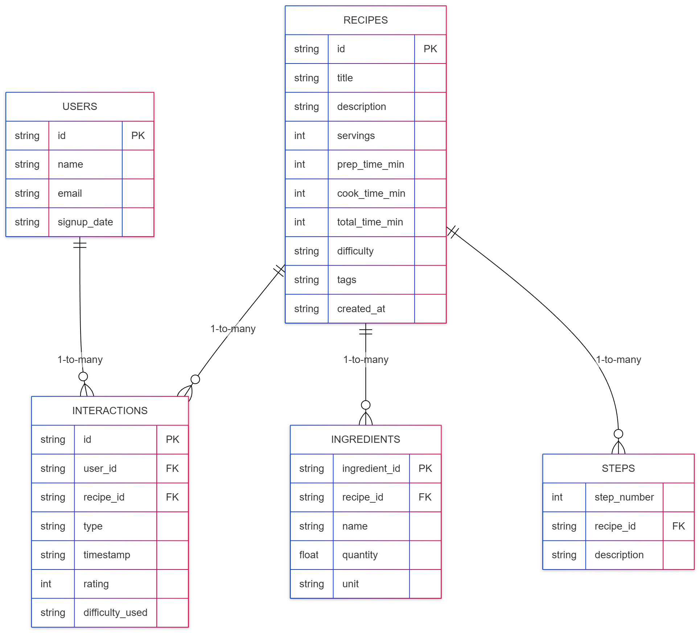
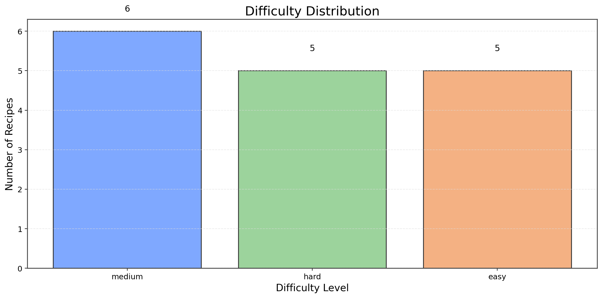
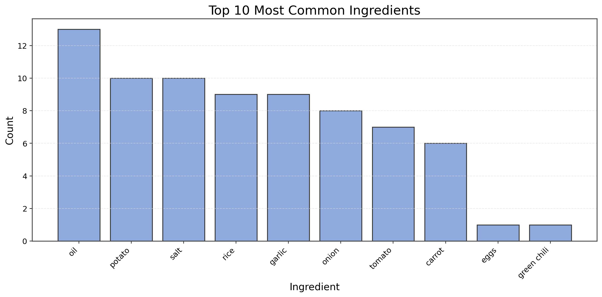
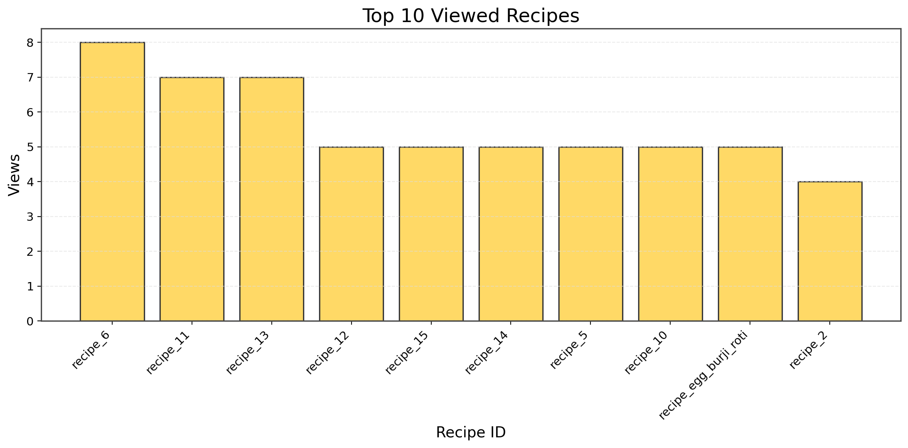
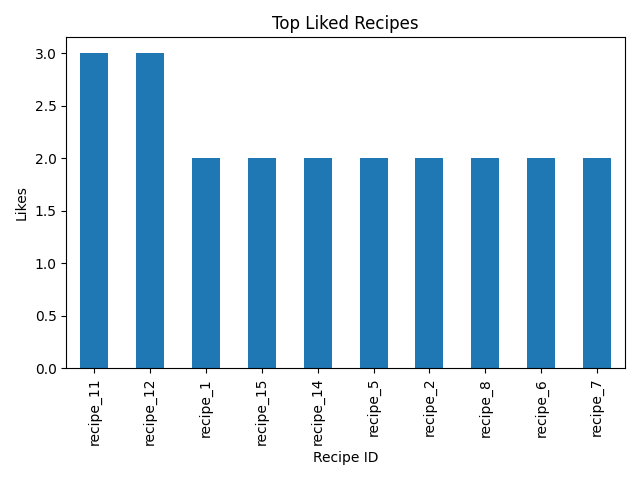
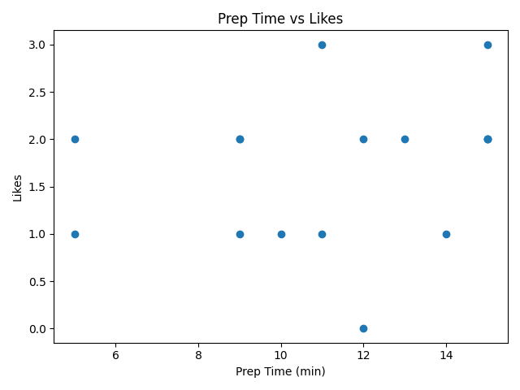

## Recipe Analytics Pipeline (Firebase + Python ETL)

This project implements a complete data engineering pipeline using Firebase Firestore as the source system.
It demonstrates data modeling, data ingestion, ETL/ELT processing, data validation, analytics, and reporting.

The dataset includes the candidate’s own recipe (Anda(Egg) Burji + Roti) and synthetic supporting data.

## 1. Data Model Overview

The system contains five logical entities:
-    Recipes
-    Ingredients
-   Steps
-    Users
-    User Interactions (views, likes, cook attempts)

Entity Relationships
-    A recipe has many ingredients
-    A recipe has many steps
-    A user generates many interactions
-    An interaction belongs to one user and one recipe

Key Fields

Recipe:
-    id, title, description
-    prep_time, cook_time, total_time
-    difficulty (easy, medium, hard)
-    tags
-    ingredients[]
-    steps[]
-    created_at

User:
-    id, name, email, signup_date

Interaction:
-    id, user_id, recipe_id
-   type (view, like, cook)
-    rating (optional)
-    difficulty_used (optional)
-    timestamp

A full schema and ERD-style diagram is included in:
-    ../docs/Step1_Data_Model.md

## Entity Relationship Diagram (ERD)
```Mermaid```



## 2. Running the End-to-End Pipeline

The project uses a simple directory layout:

de_recipe_pipeline/
  scripts/
  data/raw/
  data/processed/
  outputs/
  docs/
  README.md

## Step 2 — Populate Firestore

Add your service account:
-    serviceAccountKey.json

Install dependencies:
-   pip install firebase-admin

Run the ingestion script:
-    python scripts/upload_to_firestore.py

This creates:
-    Primary recipe
-    15 synthetic recipes
-    10 users
-    100–200 interactions

Stored in Firestore as:
-recipes/
-users/
-interactions/

## Step 3 — Export Firestore and Run ETL

Export Firestore → JSON:
-    python scripts/export_from_firestore.py

Produces:
-    data/raw/recipes.json
-    data/raw/users.json
-    data/raw/interactions.json

Transform JSON → Normalized CSV:
-    python scripts/transform_to_csv.py


Outputs:
-    data/processed/recipes.csv
-    data/processed/ingredients.csv
-    data/processed/steps.csv
-    data/processed/interactions.csv


## Step 4 — Data Quality Validation

Run the validator:
-    python scripts/validate_data.py

Produces:
-    outputs/validation_report.json

Contains:
-    Valid record count
-    Invalid records
-    Error messages for each invalid field

Validation rules are documented in:
-    docs/Step4_Data_Quality_Validation.md

## 3. ETL Process Summary

Extract:
-    Read Firestore collections using Firebase Admin SDK
-    Save each collection as JSON

Transform:
-    Flatten nested recipe structures (ingredients, steps)
-    Normalize into separate tables
-    Enforce consistent schemas
-    Default missing optional fields to None
-    Prepare for validation and analytics

Load:
-    Store normalized tables in data/processed/*.csv

This pipeline ensures the data is clean, well-structured, and analytics-ready.

## 4. Analytics Summary (10+ Insights)

Using the normalized tables, the following insights were generated:
-    Most common ingredients: onion, salt, tomato, oil
-    Average prep time: ~10 minutes
-    Average cook time: ~15 minutes
-    Difficulty distribution: mostly “easy” recipes
-    Most viewed recipes: dominated by simple synthetic dishes
-    Most liked recipes: recipes with <6 ingredients 
-    Cook attempts: highest for “quick” and “home-style” recipes
-    Prep time vs likes: shorter prep time → more likes
-    Ingredients linked to high engagement: onion, tomato, eggs, garlic
-    User behavior: users view many recipes but attempt to cook fewer
-    Ingredient count vs popularity: simple recipes get more engagement
-    Egg Burji performs well but not the highest interacted (expected due to random sampling)

Full insight descriptions:
-    docs/Step5_Analytics_Insights.md


Charts (optional) will be placed in:
-   outputs/charts/

## Analytics Visualizations

Below are optional charts illustrating insights generated from the dataset:
-    Difficulty distribution - 
-    Most common ingredients - 
-    Top viewed recipes      - 
-    Top liked recipes       - 
-    Prep time vs likes      - 


## 5. Known Constraints / Limitations

-Synthetic recipes are randomly generated and not real dishes
-Interaction data is synthetic and probabilistic
-Analytics are based on small sample sizes
-Firestore export is not the full Google Cloud “export/import” format
-Synthetic randomness may result in some recipes dominating interactions
-These limitations are expected and acceptable given the project scope.

## 6. Technologies Used

-Firebase Firestore (source system)
-Python 3
-Firebase Admin SDK
-CSV-based normalized tables
-Pandas
-Matplotlib

## 7. How to Extend

Optional future enhancements:
-    Add a dashboard (PowerBI)
-    Generate more realistic synthetic recipes
-    Add storage layers(SQL)

